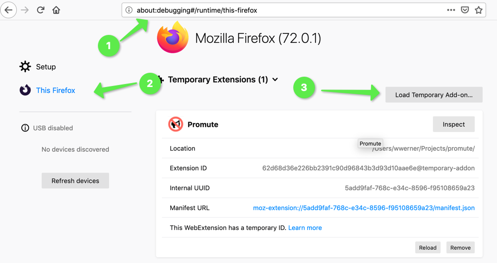
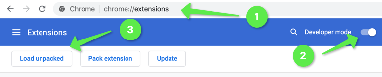

# promute
Promute is a browser addon that automatically mutes twitter accounts sending promotions to your timeline as you scroll by.

It does the simplest thing that could possibly work.
Within a scroll listener, it ...
* ... identifies promoted tweets by the 'Promoted' label at the bottom,
* ... opens the tweets context menu,
* ... and clicks the mute button

You can review the muted accounts as usual in your twitter settings: https://twitter.com/settings/muted/all

## Requirements

Promute is known to work with current versions of Firefox (v72) and Chrome (v87). Other browsers have not been tested.

## Installation 

### From Addon Directory

For Firefox, install the extension from the FF addon directory: https://addons.mozilla.org/en-US/firefox/addon/promute/.

You'll be hopefully able to install it from the Chrome Web Store as well soon.
In the meantime, use the manual installation method.

### Manual Installation - Firefox

* Clone or download & unpack (https://github.com/wwerner/promute/archive/main.zip) this repository,
* open the about:debugging page, 
* click "This Firefox" (in newer versions of Firefox), 
* click "Load Temporary Add-on", 
* then select any file in your extension's directory.

Source: https://developer.mozilla.org/en-US/docs/Mozilla/Add-ons/WebExtensions/Your_first_WebExtension#Installing

### Manual Installation - Chrome

* Clone or download & unpack (https://github.com/wwerner/promute/archive/main.zip) this repository,
* go to chrome://extensions,
* enable `Developer Mode`,
* click `Load Unpacked`,
* and select the downloaded repository's root folder

🥳 Enjoy your twitter feed w/o promotions.

Feel free to raise an issue on Github, if it does not work for you.

