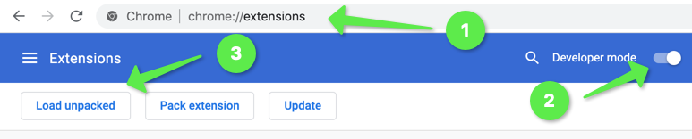

# promute
Promute is a Chrome Extension that automatically mutes twitter accounts sending promotions to your timeline as you scroll by.

It does the simplest thing that could possibly work.
Within a scroll listener, it ...
* ... identifies promoted tweets by the 'Promoted' label at the bottom,
* ... opens the tweets context menu,
* ... and clicks the mute button

## Installation

You'll be hopefully able to install it from the Chrome Extensions Web Store at 
https://chrome.google.com/webstore/category/extensions soon. 

In the meantime, you'll need to ...

* ... clone or download the repository,
* ... go to chrome://extensions,
* ... enable `Developer Mode`,
* ... click `Load Unpacked`,
* ... and select the downloaded repository's root folder

🥳 Enjoy your twitter feed w/o promotions.

Feel free to raise an issue on Github, if it does not work for you.

